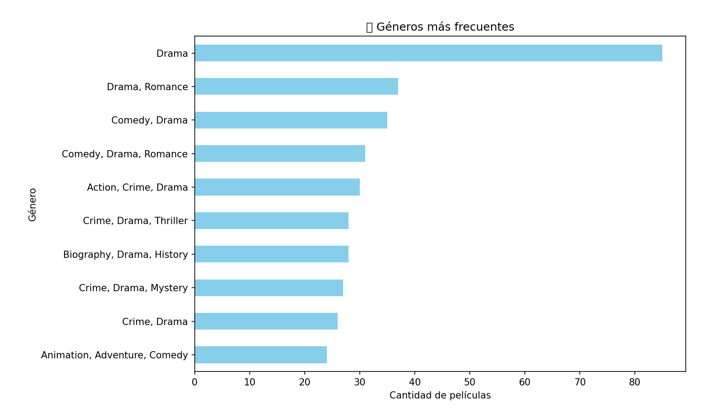
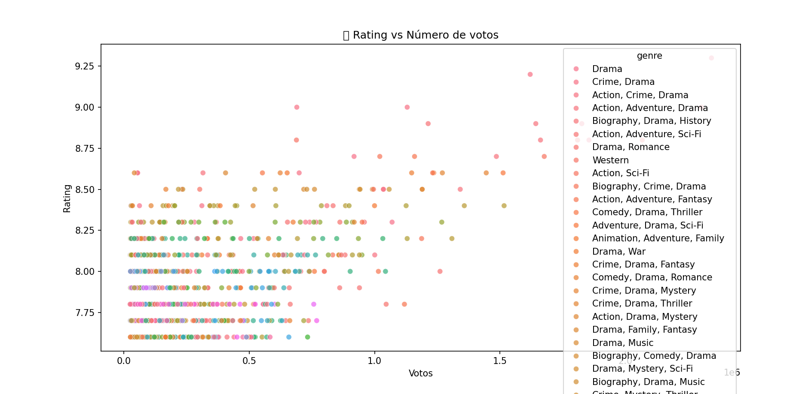
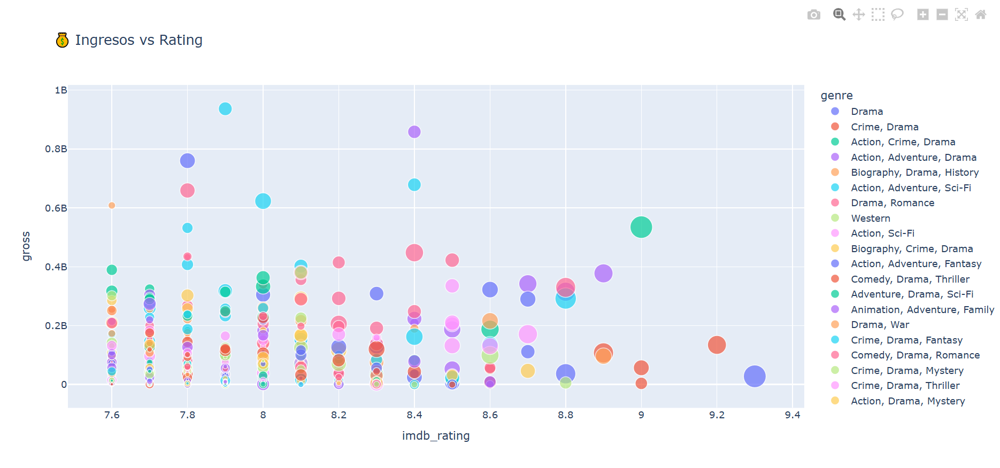

# analisis-imbd-peliculas
Análisis de Datos de Películas - IMDb Top 1000

Este proyecto explora el top 1000 de películas según IMDb para descubrir patrones relacionados con géneros, duración, rating, votos y recaudación.

# Dataset

- Dataset utilizado: `imdb_top_1000.csv`
- Columnas principales:
  - `series_title`: título de la película
  - `genre`: género principal
  - `runtime`: duración (en minutos)
  - `released_year`: año de estreno
  - `imdb_rating`: puntuación promedio
  - `no_of_votes`: cantidad de votos
  - `gross`: recaudación en millones USD

# Tecnologías usadas

- Python
- pandas
- numpy
- matplotlib
- seaborn
- plotly

# Preguntas que responde

- ¿Cuáles son los géneros más frecuentes?
- ¿Qué películas tienen el mejor rating?
- ¿Cuánto duran en promedio?
- ¿Hay relación entre votos, ingresos y rating?
- ¿Cuál fue la década más productiva?

# Visualizaciones

- Géneros más frecuentes (`generos_frecuentes.png`)
- Rating vs Votos (`rating_vs_votos.png`)
- Correlación entre ingresos, votos y rating (`correlacion_variables.png`)
- Gráfico interactivo con Plotly

# Análisis visual

Durante el análisis exploratorio de los datos, se generaron varias visualizaciones para comprender mejor la información contenida en el dataset.

# Géneros más comunes

# Correlación entre variables
Visualización de la correlación entre variables numéricas como ingresos (`gross`), votos y puntuación en IMDb.

# Relación entre votos y rating (IMDb)
Un scatterplot que muestra cómo se relaciona la cantidad de votos con el rating.

# Relación entre ingresos y rating
Gráfico interactivo (Plotly) para visualizar cómo varían los ingresos según el rating.

#Conclusiones

- Los géneros más comunes son Drama, Action y Comedy.
- Las películas mejor calificadas no siempre son las más taquilleras.
- La década más productiva fue la de los 2000s.
- No hay correlación fuerte entre rating y recaudación.
